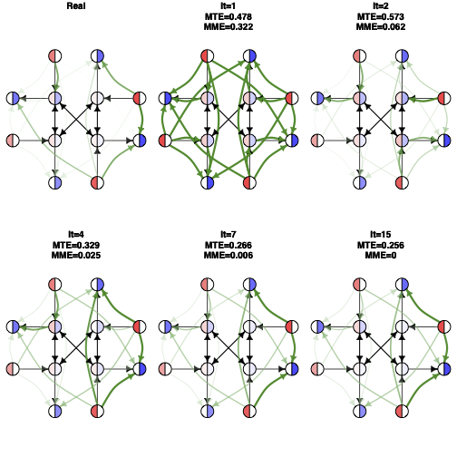
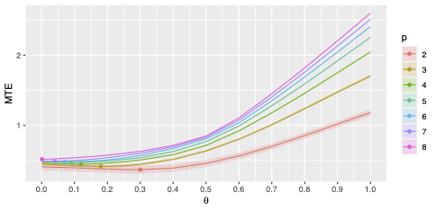
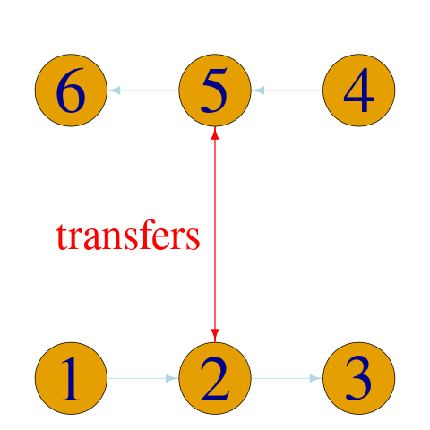

# Estimation of flow trajectories in a multi-lines transportation network

### Guillaume Guex, Romain Loup, François Bavaud

This repository contains the data and code in order to produce the results in the (upcoming) article *Estimation of flow trajectories in a multi-lines
transportation network*, with applications to the public transportation network in the city of Lausanne.

## Abstract 

Characterizing a public transportation network, such as an urban network
with multiple lines, requires the origin-destination trip counts during a given
period. Yet, if automatic counting makes the embarkment (boarding) and
disembarkment (alighting) counts in vehicles known, it often happens that
pedestrian transfers between lines are harder to track, and require costly and
invasive devices (e.g., facial recognition system) to be estimated. In this
contribution, we propose a method, based on maximum entropy and
involving an iterative fitting procedure, which estimates the passenger flow
between origins and destinations solely based on embarkment and
disembarkment counts. Moreover, this method is flexible enough to provide
an adaptable framework in case additional data is known, such as attraction
poles between certain nodes in the network, or percentages of transferring
passengers between some lines. This method is tested on toy examples, as
well as with the data of the public transportation network of the city of
Lausanne provided by its Transportation Agency (tl), and gives arguably
convincing estimations of the transportation flow.

## Keywords 

multiline bus network; origin-destination flows; boarding and alighting counts; maximum entropy estimation; iterative
proportional fitting

## Some Results

<figure>
    
    <figcaption>Iteration example on a toy network. The network edges are represented by black edges, transfer flow is represented by green edges</figcaption>
</figure>

<figure>
    
    <figcaption>Mean transportation error (MTE) on different toy examples size (p) vs the minimum embarkement/disembarkment rate $\theta$</figcaption>
</figure>

## Tutorial 

To present how the algorithm work, we present a small tutorial with a very simple network (the code for this tutorial can be found in `0.0_tutorial.R`). This network have two lines, with 3 stops each, and transfer edges connecting their middle stops.

<figure>
  
  <figcaption>Tutorial network</figcaption>
</figure>

